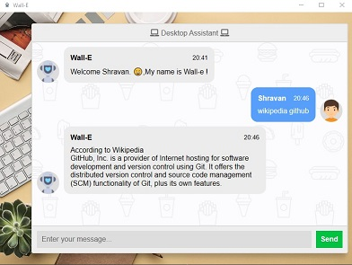

# Wall-E


## A virtual assistant named Wall-E written mainly in Python
Wall-E is a virtual assistant written in pure Python, it can be your just another friend and talk to you like any other human. There are many embedded features in this bot which can be used to get personalized information like the weather around you, the news and many other things.

### Some key features of Wall - E
- Send email
- Open Google
- Get latest news
- Get Wikipedia summary
- Get weather of a place
- Play music
- Play YouTube videos
- Reminder feature
- Todo lists
- Fun facts
- Jokes 
<br>  and more....

### Some of the common commands
- **Send email** - 
To send email, simply type "send mail to some.one@domain.com" and message will be delivered to that person.

- **Open Google** - To open Google, simply type "Wall - E, open Google" and Google will open in your default browser.

- **Get news** - 
To get some of the latest news, you need to type "Wall - E, tell me some news" or any other relevant command and news will be printed.

- **Get Wikipedia summary** - 
To get Wikipedia summary on any particular topic, type "Wikipedia Python". 


- **Get weather of a place** - 
To get weather of a place, type "weather russia", or something like that.

- **Play Music** - 
To play music, type "Play music" and it will play any random music which is in your system.

- **Play in-app YouTube video** - 
To play any YouTube video, type "Play Shape of You on YouTube" or "Search youtube for Python" and it will play that YouTube video.


- **Reminder Ability** -
To add a reminder, just type "remind me to {your reminder} {time in dd-mm-yyyy hh:mm format} and it will automatically remind you. Example - *remind me to do exercise 26-01-21 18:00*.


- **Todo Lists** -
To add a todo, just type "add a todo {todo name}" and it will be added to the todo list! Other commands are "delete a todo {name}" and "view todos".


- **Ask any random question** - Ask any random question to Wall-E and it will answer the question.


There are many other features, explore our bot to find out. ;-)

<br>

## Team Members
<!-- Add what you contributed here -->
| Member | Contribution |
| -- | -- |
| [Amal Thomas](https://github.com/amalthomas-exe) | GUI, bot server |
| [Shravan](https://github.com/Shravan-1908) | Todo lists, reminders, music player |
| [Ankit](https://github.com/Ankit404butfound) | News, Jokes, README |

<br>

## Installation
### EXE release
Download the *exe* release of the app by clicking [here](https://github.com/amalthomas-exe/Wall-E/releases/download/1.1/Wall-E.Setup.exe).

### Using Git
Type the following command in your Git Bash:

- For cloning via SSH:
```git clone git@github.com:amalthomas-exe/Wall-E.git```
- For cloning via HTTPS: ```git clone https://github.com/amalthomas-exe/Wall-E.git```

Then for installing the required libraries, type in:<br>
```pip install -r requirements.txt```

The whole repository would be cloned in the directory you opened the Git Bash in.

### ZIP download
You can alternatively download the repository as a zip file by clicking [here](https://github.com/amalthomas-exe/Wall-E/archive/main.zip).
